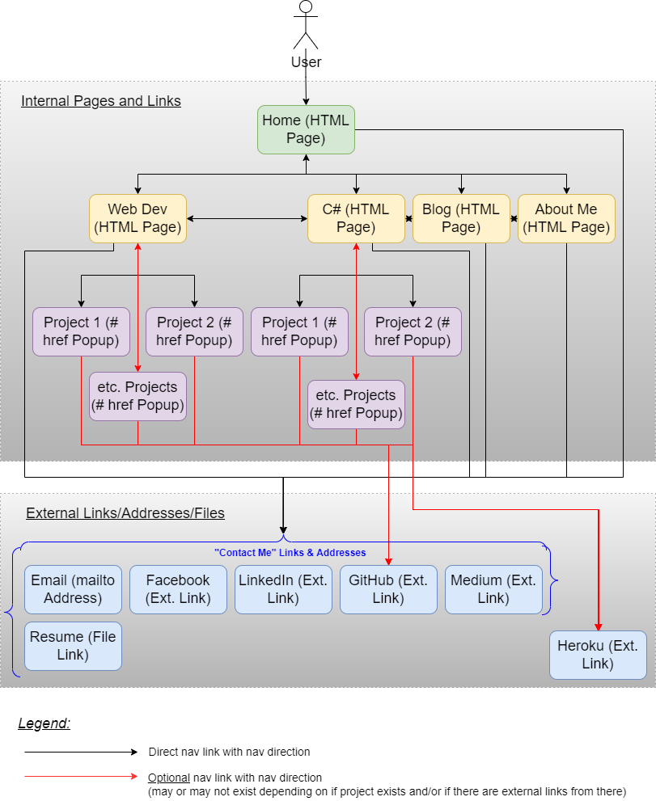
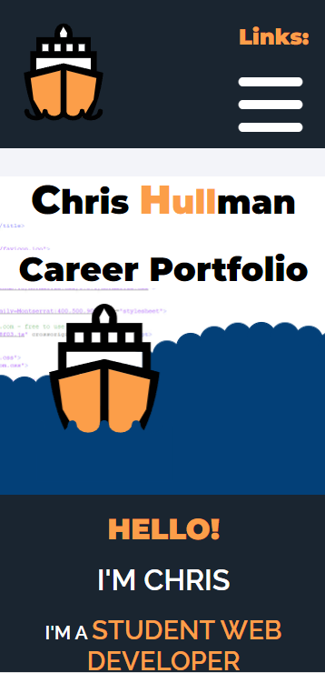
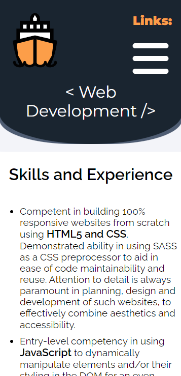
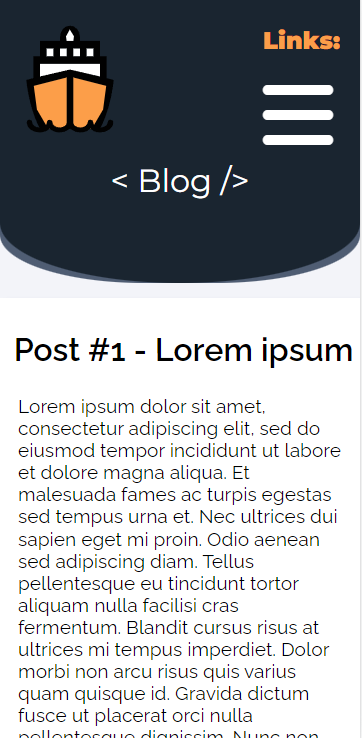
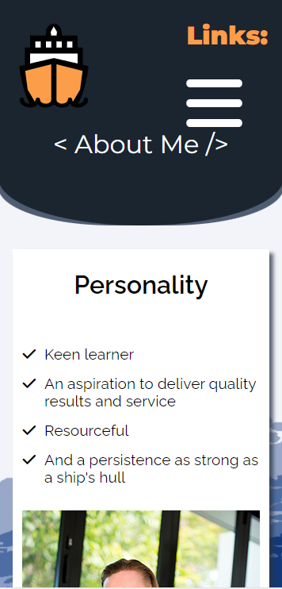

# Portfolio of Christopher (Chris) Hullman
### *For 'Coder Academy' Web Development 2022 Standard (Feb. intake)*

## Link to Live Website:

[**https://chullman.netlify.app/**](https://chullman.netlify.app/)

## Link to GitHub Repository:

[**https://github.com/chullman/portfolio-v2**](https://github.com/chullman/portfolio-v2)

## Portfolio Description

### Purpose:

The purpose of my portfolio is to promote and market my identity and personality, capabilities, competencies, and both technical and soft skills and experience to the target audience. Besides showcasing information about me as a person, it should showcase all my current and prior achievements as a student web developer and IT professional. It is hoped that my portfolio website, along with my resume, will together provide the foundation of detail necessary for me to land and secure a job and career as a web developer or as another IT professional.

### Functionality: / Features:

The key functionalities of my portfolio is that it should have:
- A professional looking UI and aesthetic
- A fun and engaging theme and appeal to the audience
- An accessible and responsive UI/UX
- A purposeful objective

The website functions as a purely static, front-end web application, with no behind-the-scenes back-end communication with a database or a web server (except to retrieve the current HTML page), for example.

All navigation to other internal HTML pages, or navigation to an element with a matching "id" attribute, is done via HTML anchor elements as hyperlinks.

The theme of the portfolio is one of a hopefully engaging and accessible "ocean" and "nautical" theme, chosen from taking a pun of the word "hull" in my surname, "Hullman", to represent the hull of a ship.

The website features multiple "components", that is, blocks of self-contained HTML elements styled with self-created CSS (via use of SASS preprocessor), containing text, colours, images or other such graphics. Each component uniquely serves to satisfy the aforementioned purpose and key functionalities of the portfolio.

Even though it is not required for the "Coder Academy" assessment, I used optional self-created JavaScript that serves two functions that further reinforce the key functionalities of my portfolio, and these two are:
- Increasing accessibility - On mobile devices, the top navigation bar links collapse into a “hamburger” icon. JavaScript is used here to detect when the user touches the hamburger icon (as it’s not an anchor element), and displays a dropdown box containing the hyperlinks to the other internal HTML pages. Additionally, JavaScript is used here to increase accessibility by detecting if the user touches on the screen *outside* of the dropdown box, forcing the dropdown box to disappear.
- Increasing fun and engagement to the user - On the Home Page, the “hero” component (aka, the “jumbotron”) features a blue “wave” animation. Regular CSS was used mostly to animate the elements of the wave, and JavaScript simply adds different delays in animation timing of each of these elements to simulate the wave effect. 

See the code comments in my JavaScript file for more information, including code references: [**https://github.com/chullman/portfolio-v2/blob/master/js/custom.js**](https://github.com/chullman/portfolio-v2/blob/master/js/custom.js) (open in your favourite text editor or IDE).

### Sitemap:

### Screenshots:

Only mobile phone views of each HTML page and any popups are displayed below.

(See [**https://github.com/chullman/portfolio-v2/tree/master/docs**](https://github.com/chullman/portfolio-v2/tree/master/docs) for the screenshots of all other device viewports.)

#### Home Page

#### Projects Page

#### Project Popup Window

#### Blog Page

#### About Me Page

### Target Audience:

There are three primary target audiences of my portfolio:
- Recruiters and employers of established businesses, or established or up-and-coming start-up organisations, proactively seeking web developers or other such IT professionals.
- Recruiters and employers of established businesses, or established or up-and-coming start-up organisations that I myself have applied to directly in relation to a job vacancy.
- If I choose a career as a freelance web developer, the target audience will directly be my customers seeking a web developer to develop a project for them.

### Tech Stack:

- HTML5
- CSS3
- Front-end JavaScript
- Deployment platform: Netlify
- CI/CD: Netlify linked with source GitHub repository
- Source code storage platform: GitHub repository
